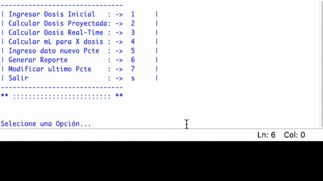

# Proyecto PET Manager

_Aplicacion capaz de gestionar de manera optimizada la dosis de farmacos Radiactivos en CLR_

_Pet Manager es un Proyecto realizado para el Ramo Proyecto de Titulo de la Universidad Andres Bello_

_Carrera de Ingeniería en Computación e Informática - Advance 2019_

## Pre-requisitos 📋

_Necesario para su instalación como minimo Windows 7 32 bits, con 500 MB de memoria y 4 GB de almacenamiento en el disco._

## Instalación 🔧

_Se puede ejecutar Scrip con Ide-consola Phyton 3.7 - Codigo Principal [PetManager](https://github.com/Sebasinos/ProyectoPET/blob/master/src/Programa_principal.py)_

_Se puede Instalar ultima versión lanzada - Instalador windows [PetManager](https://github.com/Sebasinos/ProyectoPET/releases/tag/V0.4)_
```
Seguir Instrucciones de instalador (aceptar licencia de uso).
```

## Documentación ⚙️

_Mudulos de PETManager:_

[Modulo Calculadora de Decaimiento Radiactivo](https://github.com/Sebasinos/ProyectoPET/blob/master/docs/Doc_Codigo/Documentacion-cal_decay.md)

[Modulo Diferencia entre dos horas](https://github.com/Sebasinos/ProyectoPET/blob/master/docs/Doc_Codigo/Documentacion-cal_dif_min_proy.md)

[Modulo Limpiar Consola](https://github.com/Sebasinos/ProyectoPET/blob/master/docs/Doc_Codigo/Documentacion-clean.md)

[Modulo Crear un archivo csv](https://github.com/Sebasinos/ProyectoPET/blob/master/docs/Doc_Codigo/Documentacion-create_file.md)

[Modulo Diferencia entre hora actual y Especifica](https://github.com/Sebasinos/ProyectoPET/blob/master/docs/Doc_Codigo/Documentacion-dif_min.md)

[Modulo Ingreso valores](https://github.com/Sebasinos/ProyectoPET/blob/master/docs/Doc_Codigo/Documentacion-dose_inicio.md)

[Modulo Calculo de mL para x Dosis](https://github.com/Sebasinos/ProyectoPET/blob/master/docs/Doc_Codigo/Documentacion-dose_ml.md)

[Modulo Calculo Dosis en tiempo Real](https://github.com/Sebasinos/ProyectoPET/blob/master/docs/Doc_Codigo/Documentacion-dose_now.md)

[Modulo Tomar ultimos Valores](https://github.com/Sebasinos/ProyectoPET/blob/master/docs/Doc_Codigo/Documentacion-dose_time_ml_last.md)

[Modulo Crear lista ordenada de datos](https://github.com/Sebasinos/ProyectoPET/blob/master/docs/Doc_Codigo/Documentacion-gen_info.md)

[Modulo Ingreso de nuevos datos](https://github.com/Sebasinos/ProyectoPET/blob/master/docs/Doc_Codigo/Documentacion-input_data.md)

[Modulo Chequeo de datos](https://github.com/Sebasinos/ProyectoPET/blob/master/docs/Doc_Codigo/Documentacion-mod_check_input.md)

[Modulo Modificar ultimo datos](https://github.com/Sebasinos/ProyectoPET/blob/master/docs/Doc_Codigo/Documentacion-mod_last_dat.md)

_Ejemplos Funcionamiento:_



* Cadena de opciones: 

* Ingreso de Dosis Inicial ->  Seleccionar opcion numerica 1 /enter -> Ingresar Dosis en mCi /enter -> Ingresar Hora en formato HH:mm / enter -> Ingresar cantidad en formato mL/ enter -> msg de "Datos ingresados con Exito".

* Solicitar Dosis Proyectada ->  Seleccionar opcion numerica 2 /enter ->  Ingresar Hora en formato HH:mm a proyectar / enter -> msg de Respuesta con dosis proyectada.

* Solicitar Dosis en tiempo real ->  Seleccionar opcion numerica 3 /enter -> msg de Respuesta con dosis en tiempo real.

* Solicitar calculo de mL para x Dosis ->  Seleccionar opcion numerica 4 /enter ->  Ingresar Dosis en mCi /enter -> msg de Respuesta con  los mL necesarios para tal dosis.

* Ingreso nuevo dato de Paciente ->  Seleccionar opcion numerica 5 /enter -> Ingresar Dosis en mCi /enter -> Ingresar Hora en formato HH:mm / enter -> Ingresar cantidad en formato mL/ enter -> msg de "Datos ingresados con Exito".

* Genera Reporte ->  Seleccionar opcion numerica 6 /enter ->  msg de "Reporte generado con Exito". - Aqui se genera un archivo csv con la informacion contenida hasta el momento junto donde se encuentra el archivo Scrip o instalacion.

* Solicitar Modificar ultimo dato Paciente ->  Seleccionar opcion numerica 7 /enter ->  Ingresa a nuevo menu de modificaciones -> Aqui se tienen 3 opciones . opc 1 Modifica Dosis - opc 2 Modifica hora - Opc 3 Modifica mL. para volver al menu principal seleccionar opcion s/enter.

* Solicitar Salir del programa ->  Seleccionar opcion caracter s/enter ->  Aplicacion se cierra.


_Pruebas :_

[Aceptacion](https://github.com/Sebasinos/ProyectoPET/tree/master/docs/Test/Acceptance)

[Desarrolador](https://github.com/Sebasinos/ProyectoPET/tree/master/docs/Test/Developer)

[Sistema](https://github.com/Sebasinos/ProyectoPET/tree/master/docs/Test/System)


## Desarollo 🛠️

_Software_

* Ambiente de desarrollo integrado/Compilador IDLE Python - Lenguaje de programación Python 3.7.1 -Gestor Grafico Qt5 Designer-Sw Para metodología -Trello -Repositorio del proyecto -Github-Sw creador instalador-Inno Setup


## Autores ✒️

_Agradecimientos_

* **Sebastian Inostroza** - *Trabajo Inicial* 
* **Patricio Castillo** - *Profesor Guia* 
